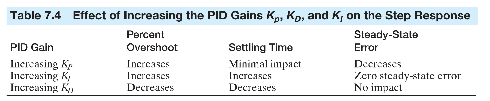

# CarND-Controls-PID

Self-Driving Car Engineer Nanodegree Program

## Author: ChangYuan Liu

---

## Reflection

### P, I, D components of the PID controller

0. The error = setpoint - measurement. In the project, cte actually is not the error; it is a (measurement - setpoint).

1. P is proportional to the current value of the error.

2. I accounts for past values of the error and integrates them over time to produce the I term.

3. D is a best estimate of the future trend of the error, based on its current rate of change.

The following table from the book [Modern Control Systems](https://www.pearson.com/us/higher-education/program/Dorf-Modern-Control-Systems-13th-Edition/PGM328731.html) is helpful for engineers to choose P, I, and D parameters.

### How to chose P, I, D

I am a control engineer in the process industries. I used to use direct synthesis method to tune PID controllers, because process models are mostly obtainable in process industries. However, the car's model is not clear in this project, so I manually tuned the controllers.

First, I implemented speed controller. Since speed control is a regulation controller, which means it only needs to maintain its setpoint, it is relatively easy to tune and PI seems working fine. Then, I tuned the lateral position controller, which is more like a tracking controller and much harder to tune. The lateral position controller becomes even harder to tune when the speed setpoint increases. At different speeds, this controller needs to be re-tuned. P and I are manually tested, and small D term is added later.

### Other thoughts

1. The PID controller implemented in the project is not in the format of digital controller, which would include time interval and may be in an incremental format.

2. Even with extensive exposure to PID controllers, I found it hard to get a good controller at higher speed than 40 MPH by manually tuning.

3. The car becomes a little "wiggling" sometimes, like the last sharp turns in the project map. If the PID controller is implemented in an incremental format, it may help. In that case, both the output and its change rate can be checked everytime the PID controller outputs.

4. The speed control and the lateral control interact with each other. When the speed control is not well tuned, it's very hard to get the lateral control tuned. I believe Model Predictive Control should be able to better handle this problem, because it can design a multivariable controller to control both speed and lateral position. For the lateral position, the MPC controller can "look ahead" through the path trajectory.

---
